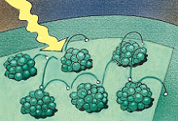
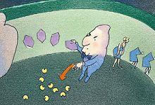
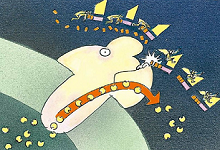
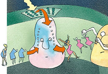

光合作用（Photosynthesis）是地球上生命的一项基本且至关重要的过程，它主要由植物、某些细菌和藻类执行。这个复杂的过程利用太阳能将无机物质转化为有机物质，同时产生氧气，对维持地球的生态平衡和大气成分具有关键作用。简单理解，光合作用即采集阳光制造糖类！♻

### 图解光合作用

#### 简略介绍绿色植物生产糖的过程

* 1、富含能量的光子打在叶片里的叶绿素上，叶绿素分子里的电子即被激发跳到能量更高的轨道上
* 2、这些精力充沛的电子，连续跳过一串叶绿素分子（跳着摇摆舞的女人）​，最后落在一些更小的载体分子上（其他的女舞者）
* 3、叶绿素分子丢失的电子由水分子分解释放的电子来补充，然后叶绿素会再次投入战斗之中
* 4、带负电的载体分子易于吸附氢离子（男舞者）​，并将氢离子转交给一种蛋白质（看门的壮汉）
* 5、这种蛋白质可以把氢离子扔进叶绿体里的类囊体
* 6、类囊体内氢离子越积越多，氢离子们便急着以一种酶作为通道（旋转门）​，夺门而出，这个集体外流的过程能促使酶合成大量ATP
* 7、电子再次被光能激活
* 8、在一种叫作烟碱胺腺嘌呤二核苷酸(NADP)的特殊分子上与氢离子结合，形成活性极高的“热氢”
* 9、一组酶利用ATP的能量，将周围环境中二氧化碳与“热氢”结合在一起，终于生产成糖

> \[!TIP]
>
> 据估计，一棵成年的健康枫树的树叶总面积将近50平方米，总重量约227千克。这意味着这棵枫树的叶绿体总面积为360平方千米，在晴朗的一天中，它可以制造2吨糖！😲

#### 1、看看叶绿体分子

叶绿素分子成簇地排列着，充当阳光感受器的角色。

当阳光照射在叶绿素分子上时，它们的电子被激发到能量更高的轨道上，四处跳跃着，直到被一种酶捕获！

#### 2、转移激发的电子

一种特殊的叶绿素——酶复合体把电子转移到类囊体膜上的载体分子中。

#### 3、水分子被裂解

叶绿体丢失的电子将由来自水分子的电子补充。

一种裂解水分子的酶把一个水分子分解成两个电子，两个氢离子和一个氧离子。

#### 4、氢离子和电子相互吸附

因为异性相吸的原理，载体上的电子能够吸引类囊体外的氢离子。回忆一下，我们讲过一个电子加上一个氢离子就能形成一个氢原子。

#### 5、门卫酶开始作业

当载体到达类囊体的内膜时，​“门卫”酶抓走了氢离子。

氢离子被扔进囊内，剩下的电子另有用途。

#### 6、开始合成ATP

氢离子离开类囊体的唯一通道是膜上的一种能够生产ATP的酶。

这种酶能够提供能量，给已经消耗的ATP残体重新加上磷。

#### 7、叶绿素复原

原先被剥夺了氢离子的电子被用来补充第二种叶绿素分子受光照激活而损失的电子。重获电子的叶绿素又要投入下一轮战斗了。

#### 8、继续转移到NADP上

最后，一种“热”氢酶把被激活的电子和一个氢离子一起转移到最后一个载体——NADP上。

现在战场转移到了基质——在叶绿体以内，类囊体以外的地方。碳循环开始了，这个过程中有5种酶协作，利用ATP和叶绿体刚刚制作好的“热”氢生成糖的前体分子。

  1、酶A把3个二氧化碳分别加到3个五碳糖分子上（这里没有显示氧）​。生成的3个六碳糖又分解成6个三碳糖。
  2、酶B用ATP激活这些三碳糖片段，
  3、酶C给这6个糖分子片段加上氢，但是只把其中的一个片段踢出流水作业线。
  4、酶D把剩下的5个三碳糖重新进行排列组合成3个五碳糖酶E用ATP把这3个糖分子激活。循环又开始了。